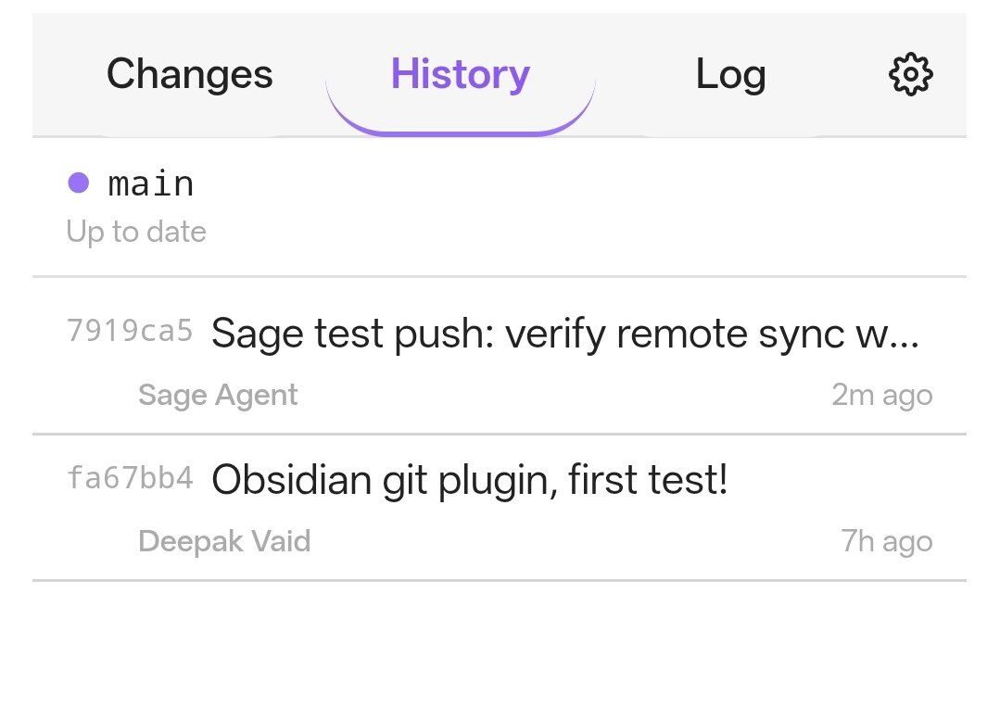
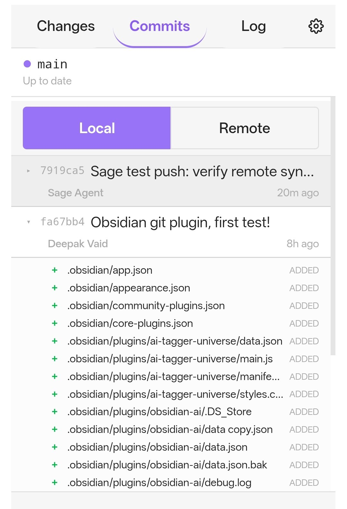
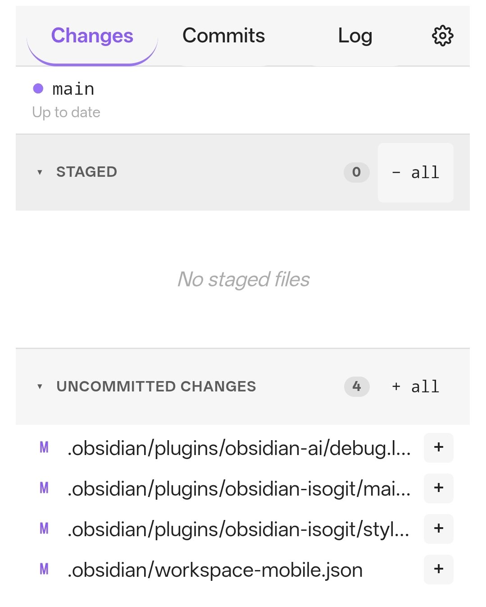

# Obsidian Git Plugin

A powerful Git synchronization plugin for [Obsidian](https://obsidian.md) that works on **both desktop and mobile** — using `isomorphic-git` under the hood, so you never need a native `git` CLI.



---

## Features

- 🔁 **Sync your vault** — pull, commit, and push with one action
- 📱 **Mobile-ready** — works on iOS & Android via `isomorphic-git`
- 📁 **Changes tab** — stage/unstage files individually or in bulk
- 📜 **Commits tab** — view local & remote commit history, expand to see changed files
- 🌿 **Local & Remote** — toggle between your local `HEAD` and `origin` commits
- 🔐 **Token-based auth** — Personal Access Token (PAT) support for GitHub/GitLab
- ⚡ **Force Push** — for first-time pushes or resolving diverged histories
- 🔄 **Auto-refresh** — configurable sidebar refresh interval
- ⬆️ **Auto-updates** — check stable or dev GitHub releases and install updates from Settings
- 📝 **Custom commit messages** — or auto-generated timestamped messages
- 🎨 **Native Obsidian UI** — matches your theme, no jarring external styles

---

## Installation

### From Release (Recommended)

1. Download the latest release from [GitHub Releases](https://github.com/space-cadet/obsidian-git/releases)
2. Extract the ZIP to your vault's `.obsidian/plugins/obsidian-git/` directory
3. Reload Obsidian (Command Palette → "Reload app without saving")
4. Enable in Settings → Community Plugins

### Manual Build

```bash
pnpm install
pnpm run build
```

Copy `main.js`, `manifest.json`, and `styles.css` into `.obsidian/plugins/obsidian-git/`.

---

## Setup

1. Open **Settings → Git Sync**
2. Enter your **GitHub repository URL** (e.g. `https://github.com/username/vault.git`)
3. Enter a **Personal Access Token** (PAT) in the credential field:
   - GitHub: Settings → Developer settings → Personal access tokens → Tokens (classic) → `repo` scope
   - The username field is ignored for PATs — any value works
   - The credential is stored through Obsidian `SecretStorage`, not in the
     plugin settings file. Leave the field blank to keep the current value.
4. Set your **author name & email** for commits
5. (Optional) Set **auto-sync interval** — 0 = disabled

Secure credential storage requires Obsidian 1.11.4 or newer. Existing legacy
credentials are migrated only after the host accepts a successful secure-store
write; remote operations are disabled if secure storage is unavailable. The
secret store protects the credential from ordinary plugin settings and vault
sync, but it is not an isolation boundary against other trusted plugins in the
same Obsidian process.

### Plugin updates

Git Sync checks its GitHub releases once per day when startup checks are enabled. In **Settings → Git Sync → Plugin Updates**, you can choose the stable channel, opt into dev releases, manually check with **Check Now**, or enable automatic installation for stable updates. Dev updates always ask for confirmation before installation.

---

## The Sidebar

Open the **Git Sidebar** from the ribbon icon (or Command Palette → "Open Git Sidebar").

### Changes Tab



The **Changes** tab shows your working directory in two sections:

- **Staged** — files ready to commit
- **Uncommitted** — modified or new files not yet staged

**Actions per file:**
- **±** — stage/unstage a file
- **↺** — discard changes (restore from HEAD)
- **↑** — stage all unstaged files
- **↓** — unstage all staged files

**Commit** — type a message in the footer, hit **Commit**.

**Footer buttons:**
- **Commit** — commit staged files
- **↑** — push to remote
- **↑↑** — force push (with confirmation dialog)
- **↓** — pull from remote
- **↻** — refresh sidebar

All buttons are **always visible** — disabled with a tooltip when not applicable (no hidden UI).

### Commits Tab



The **Commits** tab shows your commit history with a **Local / Remote** toggle at the top:

- **Local** — your `HEAD` commits
- **Remote** — `origin/main` (or whichever branch you configured)

**Click any commit** to expand it and see the files changed in that commit:

| Icon | Meaning |
|------|---------|
| **+** | File added |
| **−** | File deleted |
| **●** | File modified |

### Log Tab

The **Log** tab shows internal plugin activity — useful for debugging sync issues.

---

## Commands

| Command | Action |
|---------|--------|
| **Git: Sync** | Pull → Add → Commit → Push (full sync) |
| **Git: Pull** | Pull from remote |
| **Git: Commit** | Commit all changes |
| **Git: Push** | Push to remote |
| **Git: Initialize Repository** | Create a local git repo |
| **Git: Open Sidebar** | Open the Git sidebar |

---

## How It Works

This plugin uses [**isomorphic-git**](https://isomorphic-git.org/) — a pure JavaScript Git implementation — combined with Obsidian's native `requestUrl` API for HTTP. This means:

- ✅ No `git` CLI required on desktop
- ✅ Works on iOS and Android (where `git` isn't available)
- ✅ Uses Obsidian's Capacitor bridge to bypass CORS
- ✅ Your `.git` directory lives in your vault folder — fully portable

---

## Troubleshooting

### "Push rejected" — not a fast-forward
The remote has commits you don't have locally. **Pull first**, then push. If this is a first-time push to an empty repo, use **Force Push (↑↑)**.

### "Authentication failed" — 401/403
- Check your **Personal Access Token** in settings
- Ensure your token has `Contents: Read and Write` permission
- For GitHub fine-grained tokens, the **username** field can be anything — PATs don't need it

### "Pack index reading failed"
This is a known `isomorphic-git` limitation with certain pack files. The plugin now falls back to Node.js `fs` on desktop for pack index operations. On mobile, this is a hard limitation — consider using `git gc` on your repo to repack with a smaller index.

### "No remote configured" (local-only mode)
If your **repo URL** is empty, the plugin works in **local-only mode** — commits are saved locally but never pushed. Set a remote URL to enable push/pull.

---

## Development

```bash
# Install dependencies
pnpm install

# Build for production
pnpm run build

# Dev mode with watch
pnpm run dev

# The build outputs:
#   main.js     — bundled plugin
#   styles.css  — sidebar styles
#   manifest.json — plugin metadata
```

---

## License

MIT

---

## Changelog

### 1.0.0 (2026-06-01) — Public Release
- **Commits tab** — renamed from "History", now with expandable file lists
- **Local/Remote toggle** — switch between your commits and `origin` commits
- **Remote commit badges** — origin commits styled with accent bar
- **Expandable commits** — click to see added/modified/deleted files
- **GitHub Actions CI** — automated builds and releases

### v25 (2026-06-01) — Internal development
- Force Push button with confirmation dialog
- Token visibility bug fix (password field)
- Pull author error handling

### v24 (2026-05-31)
- Commit UI with message input, Commit/Push/Pull/Refresh buttons
- Changes tab redesign with staged/uncommitted sections
