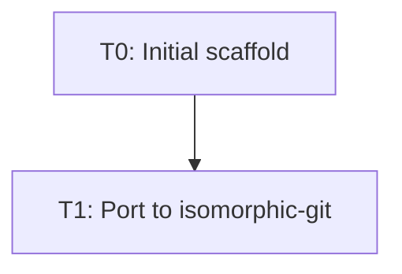

# Task Registry
*Last Updated: 2026-05-30 16:05:00 IST*

## Active Tasks
| ID | Title | Status | Priority | Started | Dependencies | Owner |
|----|-------|--------|----------|---------|--------------|-------|
| T1 | Port GitManager to isomorphic-git | 🔄 IN PROGRESS | HIGH | 2026-05-30 | - | deepak |

## Task Details

### T1: Port GitManager to isomorphic-git
**Description**: Rewrite the core git operations from `simple-git` (Node.js CLI wrapper) to `isomorphic-git` (pure JavaScript implementation) to enable mobile support. The current implementation imports Node `fs`/`path` modules which fail on mobile.

**Status**: 🔄 IN PROGRESS
**Last Active**: 2026-05-30 16:05:00 IST
**Completion Criteria**:
- [ ] Replace `simple-git` dependency with `isomorphic-git`
- [ ] Rewrite `gitManager.ts` using isomorphic-git API
- [ ] Replace Node `fs`/`path` with Obsidian `Vault` API
- [ ] Implement clone, pull, add, commit, push operations
- [ ] Implement status and log queries
- [ ] Add mobile-specific auth handling
- [ ] Test on desktop (macOS)
- [ ] Test on mobile (iOS/Android)

**Related Files**:
- `src/gitManager.ts` — Core git operations (needs complete rewrite)
- `src/main.ts` — Plugin entry point (minor changes needed)
- `src/mobile-adapter.ts` — Stubs, needs real implementation
- `package.json` — Dependency swap

**Notes**:
- Current branch: `simple-git`
- Target branch: `isomorphic-git` (to be created)
- isomorphic-git requires an `fs` backend — on mobile, we need to use Obsidian's Vault API
- HTTP Git operations may need CORS handling or a proxy on mobile

## Completed Tasks
| ID | Title | Completed | Related Tasks |
|----|-------|-----------|---------------|
| T0 | Initial plugin scaffold | 2025-03-17 | - |

## Task Relationships

