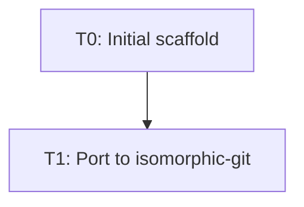

# Task Registry
*Created: 2026-05-30 16:05:00 IST*
*Last Updated: 2026-05-30 17:45:00 IST*

## Active Tasks
| ID | Title | Status | Priority | Started | Dependencies | Owner |
|----|-------|--------|----------|---------|--------------|-------|
| T1 | Port GitManager to isomorphic-git | 🔄 IN PROGRESS | HIGH | 2026-05-30 | - | deepak |

## Task Details

### T1: Port GitManager to isomorphic-git
**Status**: 🔄 IN PROGRESS — Phase 1 Complete, Design Done
**Priority**: HIGH
**Started**: 2026-05-30
**Last Active**: 2026-05-30 17:45:00 IST

**Description**: Rewrite core git operations from `simple-git` (Node CLI wrapper) to `isomorphic-git` (pure JavaScript) to enable mobile support.

**Phases:**
- ✅ Phase 1: Foundation & Research (code analysis, dependency analysis, memory bank setup)
- ✅ Phase 1.5: Design & Planning (techContext, systemPatterns, detailed implementation plan)
- ⏳ Phase 2: Branch Setup & Dependency Swap
- ⏳ Phase 3: Vault FS Adapter (Critical)
- ⏳ Phase 4: GitManager Rewrite
- ⏳ Phase 5: HTTP Client & Auth
- ⏳ Phase 6: Integration & Testing
- ⏳ Phase 7: Cleanup & Documentation

**Completion Criteria**: See `tasks/T1.md` for detailed checklist

**Related Files**:
- `src/gitManager.ts` — Core git operations (complete rewrite needed)
- `src/main.ts` — Plugin entry point (minor changes)
- `src/mobile-adapter.ts` — Stubs, needs real implementation
- `src/settings.ts` — Add token auth UI, hide SSH on mobile
- `implementation-details/isomorphic-git-port-plan.md` — Detailed 7-phase plan
- `memory-bank/techContext.md` — Technology decisions
- `memory-bank/systemPatterns.md` — Architecture patterns

**Estimated Timeline**: 10-14 hours focused work (Phases 2-7)

## Completed Tasks
| ID | Title | Completed | Related Tasks |
|----|-------|-----------|---------------|
| T0 | Initial plugin scaffold | 2025-03-17 | - |

## Task Relationships

## Notes
- T1 is currently in DESIGN phase (Phase 1.5)
- Implementation (Phase 2+) ready to begin next session
- No other active tasks at this time
